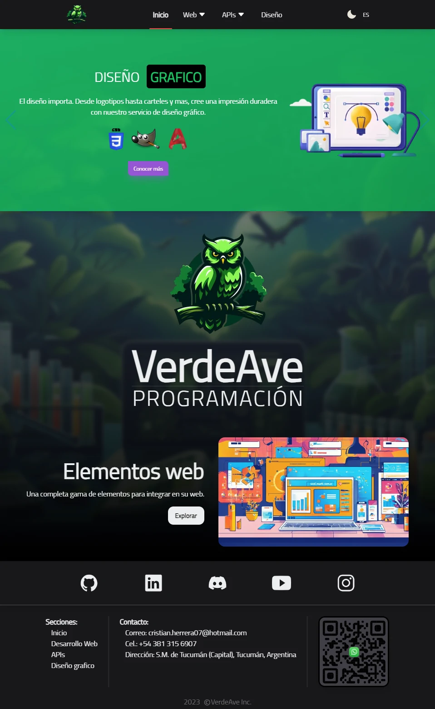
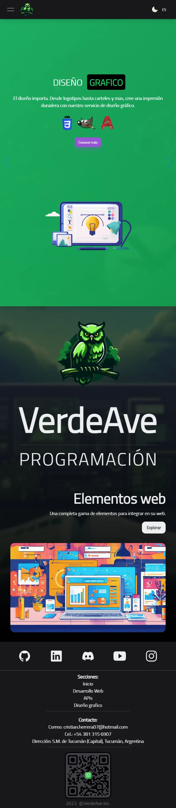
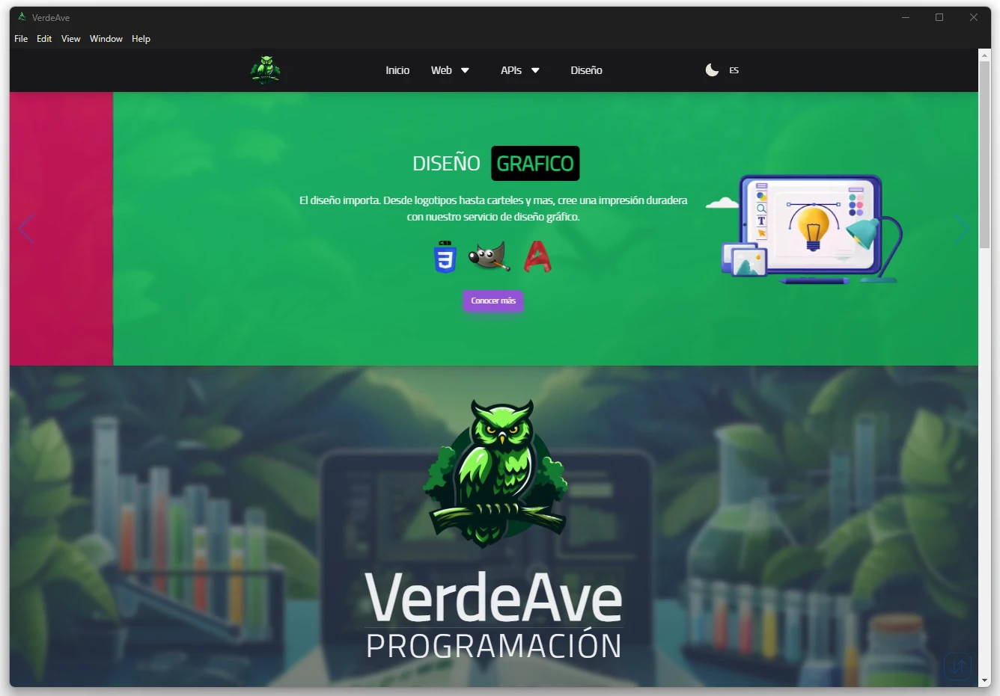

# Web VerdeAve

Web para mostrar habilidades de programacion.

Api PHP: 
https://github.com/CristianH577/WebVerdeAve-ApiPHP

Api Python:
https://github.com/CristianH577/WebVerdeAve-ApiPython

Version ejecutable: Sin APIs. Solo descargar, descomprimir y entrar al acceso directo.
https://drive.google.com/file/d/1FAkfMmcOHpVwOwBQO3SROWyxhLuUs2Zn/view?usp=sharing()

## Multimedia

  
(Version antigua)

<h1>Web</h1>

<h1>Móvil</h1>

<h1>Ventana</h1>

