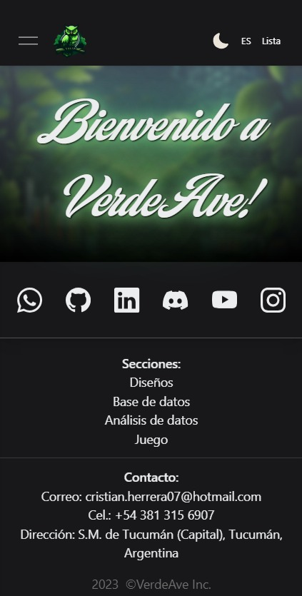

# Web VerdeAve

Web para mostrar habilidades de programacion.

Api PHP: https://github.com/CristianH577/WebVerdeAve-ApiPHP

Api Python: https://github.com/CristianH577/WebVerdeAve-ApiPython

## Multimedia

